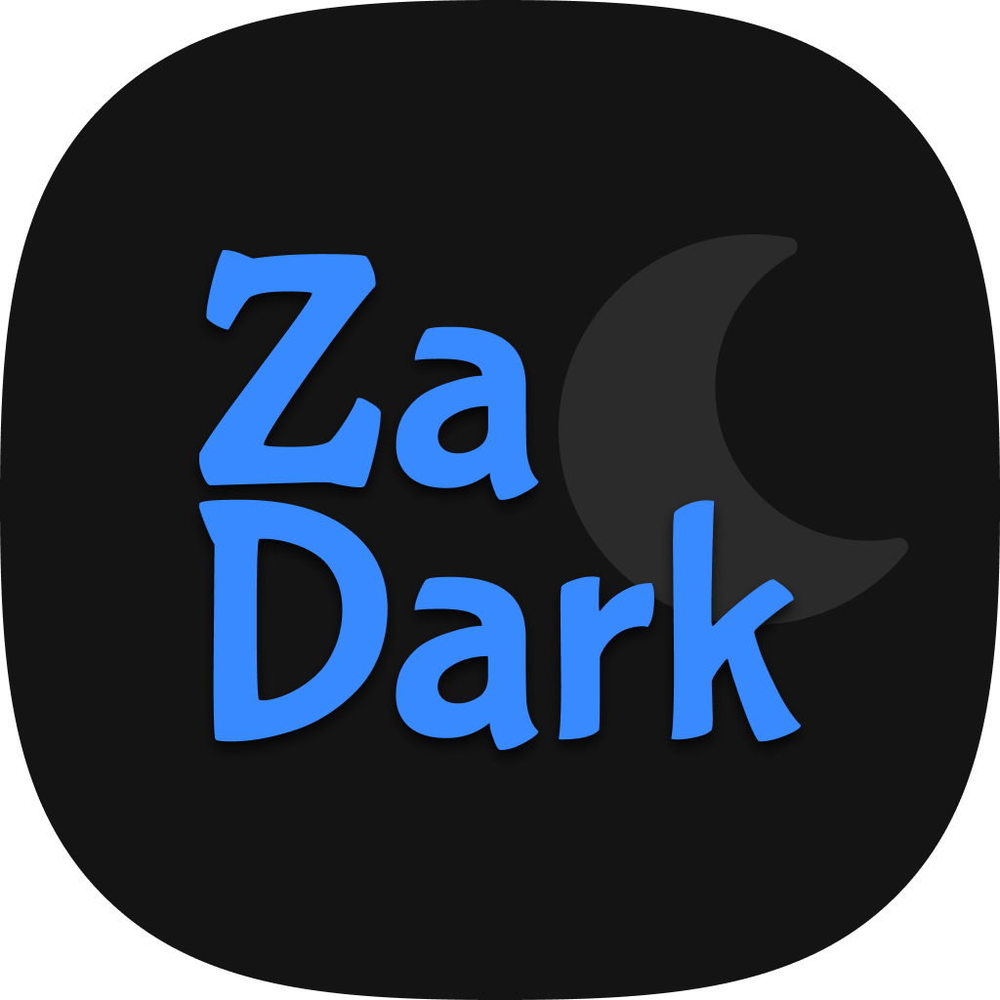
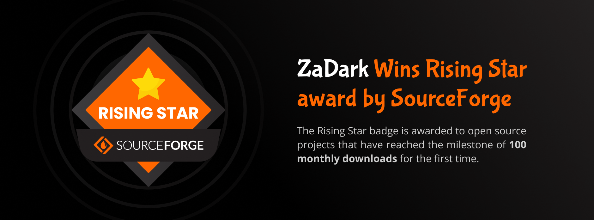

<br />

<div align="center">
  

  <h1>ZaDark – Best Dark Theme for Zalo</h1>

  <!-- [](https://short.ncdaistudio.com/zadark-win)
  [](https://short.ncdaistudio.com/zadark-mac)
  [](https://short.ncdaistudio.com/zadark-chrome)<br />
  [](https://short.ncdaistudio.com/zadark-firefox)
  [](https://short.ncdaistudio.com/zadark-opera)
  [](https://short.ncdaistudio.com/zadark-edge)
  [](https://short.ncdaistudio.com/zadark-safari) -->

  [](https://short.ncdaistudio.com/zadark-win)
  [](https://short.ncdaistudio.com/zadark-mac)
  [](https://short.ncdaistudio.com/zadark-chrome)
  [](https://short.ncdaistudio.com/zadark-firefox)
  [](https://short.ncdaistudio.com/zadark-opera)
  [](https://short.ncdaistudio.com/zadark-edge)
  [](https://short.ncdaistudio.com/zadark-safari)
</div>

<br />

<details>
  <summary>Table of Contents</summary>
  <ol>
    <li>
      <a href="#about">About</a>
      <ul>
        <li><a href="#highlights">Highlights</a></li>
        <li><a href="#important-notes">Important Notes</a></li>
      </ul>
    </li>
    <li>
      <a href="#getting-started">Getting Started</a>
      <ul>
        <li><a href="#development">Development</a></li>
        <li><a href="#creating-built-distributions">Creating Built Distributions</a></li>
      </ul>
    </li>
    <li>
      <a href="#usage">Usage</a>
      <ul>
        <li><a href="#install-for-zalo-pc">Install for Zalo PC</a></li>
        <li><a href="#install-for-zalo-web">Install for Zalo Web</a></li>
      </ul>
    </li>
    <li>
      <a href="#roadmap">Roadmap</a>
      <ul>
        <li><a href="#roadmap-for-zalo-pc">Roadmap for Zalo PC</a></li>
        <li><a href="#roadmap-for-zalo-web">Roadmap for Zalo Web</a></li>
      </ul>
    </li>
    <li><a href="#contributing">Contributing</a></li>
    <li><a href="#license">License</a></li>
    <li><a href="#contact">Contact</a></li>
    <li><a href="#awards">Awards</a></li>
    <li><a href="#acknowledgments">Acknowledgments</a></li>
  </ol>
</details>

## About

ZaDark is an open source extension for Browser and PC that helps you turn on Dark Theme for Zalo.

### Highlights

- Nice colors, good contrast.
- Allow customization according to your needs:
  - Themes: Light, Dark and Dark dimmed.
  - Sync With System: Zalo theme will match your system settings.
- Cross-platform:
  - Zalo PC: Windows and macOS.
  - Zalo Web: Chrome, Firefox, Opera, Edge and Safari.
- Open Source (https://short.ncdaistudio.com/zadark-github).

### Important Notes

- ZaDark is not a product from Zalo Group.
- ZaDark had never collected and will never collect any personal data, browsing history etc.

> ZaDark from NCDAi Studio<br />Official Website: https://zadark.ncdaistudio.com

## Getting Started

### Development

1. Clone the repo
    ```bash
    git clone git@github.com:ncdai3651408/za-dark.git
    cd za-dark
    ```

2. Install packages
    ```bash
    yarn install
    ```

3. Start development
    ```bash
    # Watching files
    yarn watch

    # or build
    yarn build

    # ➜ Output:
    # build/
    #   chrome/
    #     manifest.json
    #     ...
    #   firefox/
    #     manifest.json
    #     ...
    #   opera/
    #     manifest.json
    #     ...
    #   edge/
    #     manifest.json
    #     ...
    #   pc/
    #     index.js
    #     ...
    ```

4. Testing

- Chrome Extension
  - Step 1: Open `chrome://extensions/`
  - Step 2: Turn on `Developer Mode`
  - Step 3: Click `Load unpacked`
  - Step 4: Choose folder `build/chrome/`
- Firefox Extension
  - Step 1: Open `about:debugging#/runtime/this-firefox`
  - Step 2: Click `Load Temporary Add-on...`
  - Step 3: Choose file `build/firefox/manifest.json`
- Opera Extension
  - Step 1: Open `opera://extensions/`
  - Step 2: Turn on `Developer Mode`
  - Step 3: Click `Load unpacked`
  - Step 4: Choose folder `build/opera/`
- Edge Extension
  - Step 1: Open `edge://extensions/`
  - Step 2: Turn on `Developer Mode`
  - Step 3: Click `Load unpacked`
  - Step 4: Choose folder `build/edge/`
- Safari Extension
  - Step 1: Open `src/browser-ext/vendor/safari/ZaDark.xcodeproj` in Xcode
  - Step 2: Choose `Product > Run`
  - Step 3: Open `Safari > Preferences > Extensions` > Turn on `ZaDark – Best Dark Theme for Zalo`
- macOS & Windows
  - `yarn run pc:dev`

### Creating Built Distributions

#### For Safari Extension

1. Run `yarn build`
2. Open `src/browser-ext/vendor/safari/ZaDark.xcodeproj` in Xcode
3. Choose `Product > Archive`

> Documentation: https://developer.apple.com/documentation/xcode/distributing-your-app-for-beta-testing-and-releases

#### For Other Platforms

```bash
yarn dist

# ➜ Output:
# dist/
#   chrome/
#     ZaDark-Chrome-[VERSION].zip
#
#   firefox/
#     ZaDark-Firefox-[VERSION].zip
#
#   opera/
#     ZaDark-Opera-[VERSION].zip
#
#   edge/
#     ZaDark-Edge-[VERSION].zip
#
#   macos/
#     ZaDark-macOS-[VERSION]
#     ZaDark-macOS-[VERSION].zip
#
#   windows/
#     ZaDark-Windows-[VERSION].exe
#     ZaDark-Windows-[VERSION].zip
```

- For Google Chrome, Firefox, Opera and Microsoft Edge: Distribute `dist/[PLATFORM]/ZaDark-[PLATFORM]-[VERSION].zip` to Store
- For Windows: Distribute `dist/windows/ZaDark-Windows-[VERSION].zip` directly to users
- For macOS: Let's see the [Codesign macOS Application](#codesign-macos-application)

#### Codesign macOS Application

1. Edit the configuration file `tools/macos/config.ini`
2. Run `yarn codesign:macos` to begin the signing and notarization process
3. Enter your `username` and `password` as needed to unlock your keychain
4. Once the package is submitted to Apple, `codesign:macos` will check to see if the process is complete
5. Rejoyce in your signed `dist/macos/ZaDark-macOS-[VERSION].pkg` file
6. Distribute `dist/macos/ZaDark-macOS-[VERSION].pkg` directly to users

> `codesign:macos` script is converted from Python (https://github.com/txoof/codesign) to Node. Thanks @txoof.

## Usage

### Install for Zalo PC

- Windows
  - Download from **SourceForge.net**: https://short.ncdaistudio.com/zadark-win
  - Tutorial: https://short.ncdaistudio.com/zadark-win-tut
- macOS
  - Download from **SourceForge.net**: https://short.ncdaistudio.com/zadark-mac
  - Tutorial: https://short.ncdaistudio.com/zadark-mac-tut

### Install for Zalo Web

- Google Chrome
  - Download from **Chrome Web Store**: https://short.ncdaistudio.com/zadark-chrome
  - Tutorial: https://short.ncdaistudio.com/zadark-chrome-tut
- Firefox
  - Download from **Firefox Browser Add-ons**: https://short.ncdaistudio.com/zadark-firefox
  - Tutorial: https://short.ncdaistudio.com/zadark-firefox-tut
- Opera
  - Download from **Opera Add-ons**: https://short.ncdaistudio.com/zadark-opera
  - Tutorial: https://short.ncdaistudio.com/zadark-opera-tut
- Microsoft Edge
  - Download from **Edge Add-ons**: https://short.ncdaistudio.com/zadark-edge
  - Tutorial: https://short.ncdaistudio.com/zadark-edge-tut
- Safari
  - Download from **Mac App Store**: `coming soon ...`
  - Tutorial: `coming soon ...`

## Roadmap

### Roadmap for Zalo PC
  - [x] Platforms
    - [x] macOS
    - [x] Windows
  - [x] Basic features
    - [x] CLI (Command Line Interface)
    - [x] Install theme: Dark, Dark dimmed
    - [x] Unsintall theme
  - [ ] Advanced features
    - [ ] Check for updates
    - [x] Changelog
    - [x] Sync theme with system
    - [ ] No need to reinstall the theme when Zalo updates
    - [ ] GUI (Graphical User Interface)
    - [ ] More themes

### Roadmap for Zalo Web
  - [x] Browsers
    - [x] Google Chrome
    - [x] Microsoft Edge
    - [x] Firefox
    - [x] Opera
    - [x] Safari
  - [x] Basic features
    - [x] Themes
      - [x] Light
      - [x] Dark
      - [x] Dark dimmed
    - [x] Choose a theme
  - [ ] Advanced features
    - [x] Welcome page
    - [x] Changelog page
    - [x] Sync theme with system
    - [x] Allows users to Enable/Disable notifications when ZaDark updates
    - [ ] Custom Fonts
    - [ ] More themes

## Contributing

Contributions are what make the open source community such an amazing place to learn, inspire, and create. Any contributions you make are greatly appreciated.

If you have a suggestion that would make this better, please fork the repo and create a pull request. You can also simply open an issue with the tag "enhancement". Don't forget to give the project a star! Thanks again!

1. Fork the project
2. Create your feature branch (`git checkout -b feature/amazing-feature`)
3. Commit your changes (`git commit -m "Add some amazing feature"`)
4. Push to the branch (`git push origin feature/amazing-feature`)
5. Open a pull request

## License

Distributed under the MIT License. See `LICENSE` for more information.

## Contact

### Founder

Hi, I'm Nguyễn Chánh Đại - Founder of ZaDark!
If you have a new idea or report a bug, you can contact me via:

- Facebook: https://short.ncdaistudio.com/ncdai-fb
- LinkedIn: https://short.ncdaistudio.com/ncdai-linkedin
- Email: [ncdai@penphy.edu.vn](mailto:ncdai@penphy.edu.vn?subject=[ZaDark]%20Feedback)

### Social Network

- Facebook Page: https://short.ncdaistudio.com/zadark-fb-page
- Facebook Group: https://short.ncdaistudio.com/zadark-fb-group
- GitHub: https://short.ncdaistudio.com/zadark-github

## Awards

### Grateful for 1Password

ZaDark is proud to have been accepted by [1Password](https://1password.com/) for participating in the **1Password for Open Source Projects** program (https://github.com/1Password/1password-teams-open-source). Once accepted, contributors will receive a free 1Password Teams membership.


Thanks to 1Password for helping teams work more efficiently and securely.

### Rising Star award by SourceForge

ZaDark has just been recognized with a Rising Star award by SourceForge. This honor is awarded only to select projects that have reached significant milestones in terms of downloads and user engagement from the SourceForge community.



Thanks to everyone for trusting and using ZaDark!

## Acknowledgments

- https://developer.chrome.com/docs/extensions/mv3/getstarted/
- https://www.codepicky.com/hacking-electron-restyle-skype/
- https://developer.mozilla.org/en-US/docs/Mozilla/Add-ons/WebExtensions/Your_second_WebExtension
- https://frontendbabel.info/articles/developing-cross-browser-extensions
- https://gulpjs.com/docs/en/getting-started/quick-start/
- https://sass-lang.com/guide
- https://shields.io
- https://github.com/nexe/nexe
- https://github.com/vercel/pkg
- https://github.com/othneildrew/Best-README-Template
- https://github.com/1Password/1password-teams-open-source
- https://scriptingosx.com/2019/09/notarize-a-command-line-tool/
- https://github.com/txoof/codesign#codesign
- https://docs.microsoft.com/en-us/microsoft-edge/extensions-chromium/getting-started/
- https://dev.opera.com/extensions/basics/