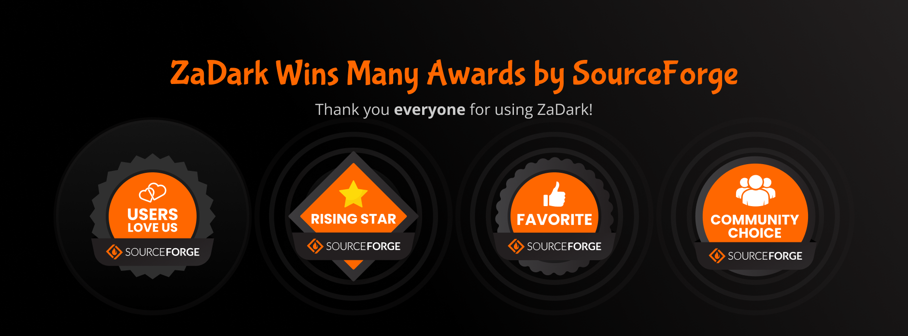

 

  

  <h1>ZaDark – Zalo Dark Mode</h1>

  
  
  
  
  
  
  

 

  
Table of Contents

  <ol>
    <li><a href="#archived">Archived</a></li>
    <li><a href="#about">About</a></li>
    <li><a href="#install">Install</a></li>
    <li><a href="#roadmap">Roadmap</a></li>
    <li><a href="#contributing">Contributing</a></li>
    <li><a href="#license">License</a></li>
    <li><a href="#contact">Contact</a></li>
    <li><a href="#awards">Awards</a></li>
    <li><a href="#acknowledgments">Acknowledgments</a></li>
  </ol>

## Archived

This repository is archived. To help us better improve the product and protect our intellectual assets, ZaDark app's development has been moved to a closed source code base.

## About

ZaDark is an open source extension that helps you enable Dark Mode for Zalo PC and Web.

https://zadark.quaric.com/

## Install

https://zadark.quaric.com/install

## Roadmap

https://zadark.quaric.com/roadmap

## Contributing

Contributions are what make the open source community such an amazing place to learn, inspire, and create. Any contributions you make are greatly appreciated.

If you have a suggestion that would make this better, please fork the repo and create a pull request. You can also simply open an issue with the tag "enhancement". Don't forget to give the project a star! Thanks again!

1. Fork the project
2. Create your feature branch (`git checkout -b feature/amazing-feature`)
3. Read [contributing/DEVELOPMENT.md](./contributing/DEVELOPMENT.md)
4. Commit your changes (`git commit -m "Add some amazing feature"`)
5. Push to the branch (`git push origin feature/amazing-feature`)
6. Open a pull request

## License

Distributed under the MIT License. See [LICENSE](./LICENSE) for more information.

## Contact

https://zadark.quaric.com/contact

## Awards

https://zadark.quaric.com/awards

## Acknowledgments

- https://developer.chrome.com/docs/extensions/mv3/getstarted/
- https://www.codepicky.com/hacking-electron-restyle-skype/
- https://developer.mozilla.org/en-US/docs/Mozilla/Add-ons/WebExtensions/Your_second_WebExtension
- https://frontendbabel.info/articles/developing-cross-browser-extensions
- https://gulpjs.com/docs/en/getting-started/quick-start/
- https://sass-lang.com/guide
- https://shields.io
- https://github.com/nexe/nexe
- https://github.com/vercel/pkg
- https://github.com/othneildrew/Best-README-Template
- https://github.com/1Password/1password-teams-open-source
- https://scriptingosx.com/2019/09/notarize-a-command-line-tool/
- https://github.com/txoof/codesign#codesign
- https://docs.microsoft.com/en-us/microsoft-edge/extensions-chromium/getting-started/
- https://dev.opera.com/extensions/basics/
- https://developer.chrome.com/docs/extensions/reference/declarativeNetRequest/
- https://developer.apple.com/documentation/safariservices/safari_web_extensions/blocking_content_with_your_safari_web_extension