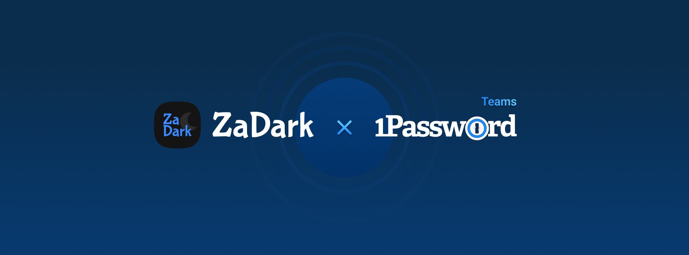
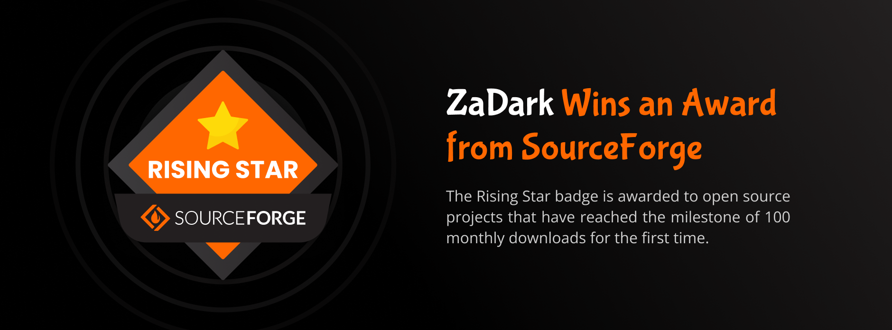

# ZaDark – Best Dark Theme for Zalo

[](https://chrome.google.com/webstore/detail/za-dark/llfhpkkeljlgnjgkholeppfnepmjppob)
[](https://addons.mozilla.org/en-US/firefox/addon/zadark/)
[](https://sourceforge.net/projects/zadark/files/ZaDarkPC/macOS/)
[](https://sourceforge.net/projects/zadark/files/ZaDarkPC/Windows/)

<details>
  <summary>Table of Contents</summary>
  <ol>
    <li>
      <a href="#about-the-project">About The Project</a>
      <ul>
        <li><a href="#highlights">Highlights</a></li>
        <li><a href="#important-notes">Important Notes</a></li>
        <li><a href="#awards">Awards</a></li>
      </ul>
    </li>
    <li>
      <a href="#getting-started">Getting Started</a>
      <ul>
        <li><a href="#development">Development</a></li>
        <li><a href="#creating-built-distributions">Creating Built Distributions</a></li>
      </ul>
    </li>
    <li>
      <a href="#usage">Usage</a>
      <ul>
        <li><a href="#for-zalo-web">For Zalo Web</a></li>
        <li><a href="#for-zalo-pc">For Zalo PC</a></li>
      </ul>
    </li>
    <li><a href="#roadmap">Roadmap</a></li>
    <li><a href="#contributing">Contributing</a></li>
    <li><a href="#license">License</a></li>
    <li><a href="#contact">Contact</a></li>
    <li><a href="#acknowledgments">Acknowledgments</a></li>
  </ol>
</details>

## About The Project

This extension helps you turn on Dark Theme for Zalo, making your eyes feel comfortable when you work, especially at night.

> (*) Zalo Web https://chat.zalo.me/, Zalo PC https://zalo.me/pc/

A product from NCDAi Studio.


### Highlights

- Multi-platform support: Zalo Web and Zalo PC (macOS, Windows).
- Nice colors, good contrast.
- Safety and Transparency (Open Source: https://github.com/ncdai3651408/za-dark).
- Allow customization according to your needs:
    + Themes: Light, Dark and Dark dimmed.
    + Single Theme: Zalo will use your selected theme.
    + Sync With System: Zalo theme will match your system settings (Browser Extension  only).

### Important Notes

- This extension is not an official extension from Zalo.
- This extension only injects the CSS file to change the color scheme of Zalo without affecting any features and security of Zalo.
### Awards

#### Grateful for 1Password

ZaDark is proud to have been accepted by [1Password](https://1password.com/) for participating in the **1Password for Open Source Projects** program (https://github.com/1Password/1password-teams-open-source). Once accepted, contributors will receive a free 1Password Teams membership.



Thanks to 1Password for helping teams work more efficiently and securely.

#### Rising Star award by SourceForge

ZaDark has just been recognized with a Rising Star award by SourceForge. This honor is awarded only to select projects that have reached significant milestones in terms of downloads and user engagement from the SourceForge community.



Thanks to everyone for trusting and using ZaDark!

## Getting Started

### Development

1. Clone the repo
    ```bash
    git clone git@github.com:ncdai3651408/za-dark.git
    cd za-dark
    ```

2. Install packages
    ```bash
    yarn install
    ```

3. Start development
    ```bash
    # Watching files
    yarn watch

    # or build
    yarn build

    # ➜ Output:
    # build/
    #   chrome/
    #     manifest.json
    #     ...
    #   firefox/
    #     manifest.json
    #     ...
    #   pc/
    #     index.js
    #     ...
    ```

4. Testing

- Chrome Extension
  - Step 1: Open `chrome://extensions/`
  - Step 2: Turn on `Developer Mode`
  - Step 3: Click `Load unpacked`
  - Step 4: Choose folder `build/chrome/`
- Firefox Extension
  - Step 1: Open `about:debugging#/runtime/this-firefox`
  - Step 2: Click `Load Temporary Add-on...`
  - Step 3: Choose file `build/firefox/manifest.json`
- macOS & Windows
  ```bash
  yarn run pc:dev
  ```

### Creating Built Distributions

```bash
yarn dist

# ➜ Output:
# dist/
#   chrome/
#     ZaDark-Chrome-x.x.zip
#     ZaDark-Chrome-3.2.zip
#     ZaDark-Chrome-3.3.zip
#     ...
#   firefox/
#     ZaDark-Firefox-3.1.zip
#     ZaDark-Firefox-3.2.zip
#     ZaDark-Firefox-3.3.zip
#     ...
#   macos/
#     ZaDark-macOS-3.1.zip
#     ZaDark-macOS-3.2.zip
#     ZaDark-macOS-3.3.zip
#     ...
#   windows/
#     ZaDark-Windows-3.1.zip
#     ZaDark-Windows-3.2.zip
#     ZaDark-Windows-3.3.zip
#     ...
```

## Usage

### For Zalo Web

- Chromium Based Browsers (Google Chrome, Microsoft Edge, Opera,...)
  - Chrome Web Store: https://chrome.google.com/webstore/detail/za-dark/llfhpkkeljlgnjgkholeppfnepmjppob
  - Tutorial: https://youtu.be/T8r1k0Rhleo
- Firefox
  - Firefox Browser Add-ons: https://addons.mozilla.org/en-US/firefox/addon/zadark/
  - Tutorial: https://youtu.be/rWmSUd0uxQI

### For Zalo PC

- macOS
  - SourceForge.net: https://sourceforge.net/projects/zadark/files/ZaDarkPC/macOS/
  - Tutorial: https://youtu.be/QBmLOUF4vdA
- Windows
  - SourceForge.net: https://sourceforge.net/projects/zadark/files/ZaDarkPC/Windows/
  - Tutorial: https://youtu.be/0ndmEmzRCyU

## Roadmap

### For Zalo Web
  - [ ] Browsers
    - [x] Chromium Based Browsers: Google Chrome, Microsoft Edge, Opera,...
    - [x] Firefox
    - [ ] Safari
  - [x] Basic features
    - [x] Themes
      - [x] Light
      - [x] Dark
      - [x] Dark dimmed
    - [x] Choose a theme
  - [ ] Advanced features
    - [x] Welcome page
    - [x] Changelog page
    - [x] Sync theme with system
    - [x] Allows users to Enable/Disable notifications when ZaDark updates
    - [ ] Custom Fonts
    - [ ] More themes

### For Zalo PC
  - [x] Platforms
    - [x] macOS
    - [x] Windows
  - [x] Basic features
    - [x] CLI (Command Line Interface)
    - [x] Install theme: Dark, Dark dimmed
    - [x] Unsintall theme
  - [ ] Advanced features
    - [ ] Check for updates
    - [ ] Changelog
    - [ ] Sync theme with system
    - [ ] No need to reinstall the theme when Zalo updates
    - [ ] GUI (Graphical User Interface)
    - [ ] More themes

## Contributing

Contributions are what make the open source community such an amazing place to learn, inspire, and create. Any contributions you make are greatly appreciated.

If you have a suggestion that would make this better, please fork the repo and create a pull request. You can also simply open an issue with the tag "enhancement". Don't forget to give the project a star! Thanks again!

1. Fork the project
2. Create your feature branch (`git checkout -b feature/amazing-feature`)
3. Commit your changes (`git commit -m "Add some amazing feature"`)
4. Push to the branch (`git push origin feature/amazing-feature`)
5. Open a pull request

## License

Distributed under the MIT License. See `LICENSE` for more information.

## Contact

Hi, I'm Nguyễn Chánh Đại
  - My Facebook: [@iamncdai](https://www.facebook.com/iamncdai/)
  - My LinkedIn: [@iamncdai](https://www.linkedin.com/in/iamncdai/)
  - My Email: [ncdai@penphy.edu.vn](mailto:ncdai@penphy.edu.vn?subject=Mail%20from%20ZaDark)
  - Project Link: https://github.com/ncdai3651408/za-dark

## Acknowledgments

- https://developer.chrome.com/docs/extensions/mv3/getstarted/
- https://www.codepicky.com/hacking-electron-restyle-skype/
- https://developer.mozilla.org/en-US/docs/Mozilla/Add-ons/WebExtensions/Your_second_WebExtension
- https://frontendbabel.info/articles/developing-cross-browser-extensions
- https://gulpjs.com/docs/en/getting-started/quick-start/
- https://sass-lang.com/guide
- https://shields.io
- https://github.com/nexe/nexe
- https://github.com/othneildrew/Best-README-Template
- https://github.com/1Password/1password-teams-open-source