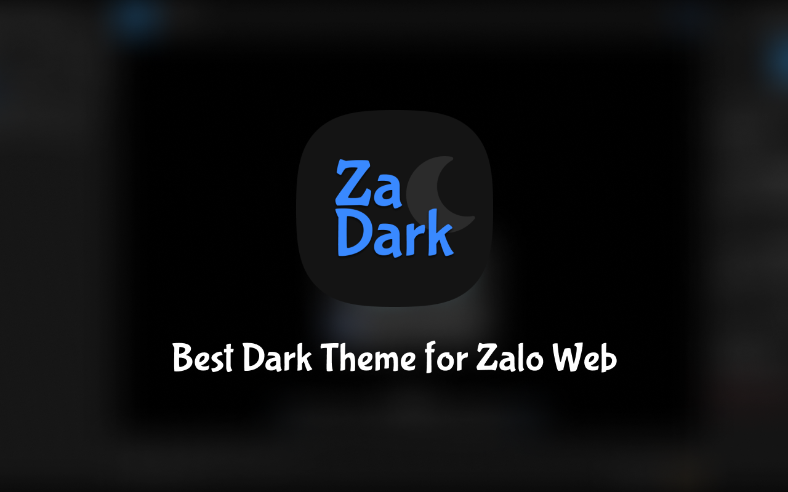

# Za Dark – Best Dark Theme for Zalo

Za Dark helps you turn on Dark Mode for Zalo Web/PC (*) - making it easier for you to look and feel less dazzling than Zalo's default interface.

> (*) Zalo Web [https://chat.zalo.me/], Zalo PC [https://zalo.me/pc/]


## Run Development

### Install

```bash
git clone git@github.com:ncdai3651408/za-dark.git
cd za-dark

# Install packages
yarn run install
```

### Sass Watch

```bash
# Chrome Extension
yarn run chrome-ext:sass-watch

# PC
yarn run pc:sass-watch
```

## Build Production

```bash
# Chrome Extension
yarn run chrome-ext:build
# ➜ Output:
#   ./build/chrome-ext/ZaDarkChromeExtension-x.x.zip

# PC
yarn run pc:build
# ➜ Output:
#   ./build/pc/ZaDarkPC-macOS-x.x
#   ./build/pc/ZaDarkPC-Windows-x.x
```

## Install
### For Zalo Web
- Chrome Web Store
  - https://chrome.google.com/webstore/detail/za-dark/llfhpkkeljlgnjgkholeppfnepmjppob
- Chrome Developer Mode (Local)
  - Load unpacked `./chrome-ext-dist`

### For Zalo PC
- ...
