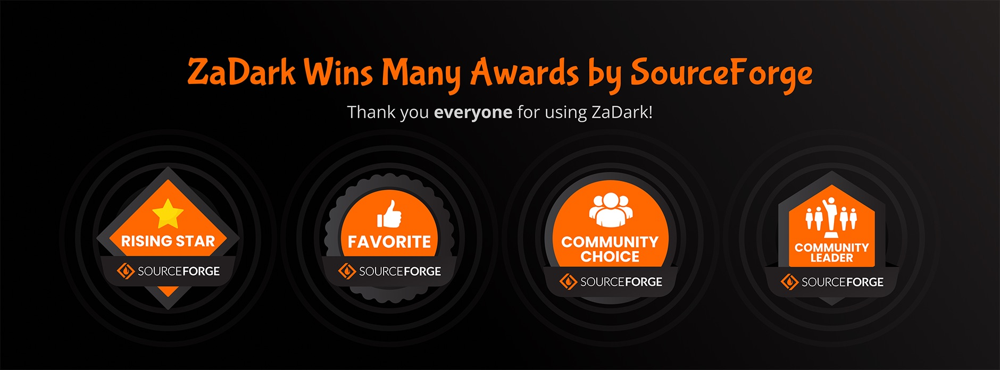

 

  

  <h1>ZaDark – Zalo Dark Mode</h1>

  
  
  
  
  [![Edge](https://img.shields.io/badge/Edge-00002D.svg?&style=for-the-badge&logo=data:image/svg+xml;base64,PHN2ZyB4bWxucz0iaHR0cDovL3d3dy53My5vcmcvMjAwMC9zdmciIHZpZXdCb3g9IjAgMCAyNCAyNCI+PHBhdGggZD0iTTIxLjg2IDE3Ljg2cS4xNCAwIC4yNS4xMi4xLjEzLjEuMjV0LS4xMS4zM2wtLjMyLjQ2LS40My41My0uNDQuNXEtLjIxLjI1LS4zOC40MmwtLjIyLjIzcS0uNTguNTMtMS4zNCAxLjA0LS43Ni41MS0xLjYuOTEtLjg2LjQtMS43NC42NHQtMS42Ny4yNHEtLjkgMC0xLjY5LS4yOC0uOC0uMjgtMS40OC0uNzgtLjY4LS41LTEuMjItMS4xNy0uNTMtLjY2LS45Mi0xLjQ0LS4zOC0uNzctLjU4LTEuNi0uMi0uODMtLjItMS42NyAwLTEgLjMyLTEuOTYuMzMtLjk3Ljg3LTEuOC4xNC45NS41NSAxLjc3LjQxLjgyIDEuMDIgMS41LjYuNjggMS4zOCAxLjIxLjc4LjU0IDEuNjQuOS44Ni4zNiAxLjc3LjU2LjkyLjIgMS44LjIgMS4xMiAwIDIuMTgtLjI0IDEuMDYtLjIzIDIuMDYtLjcybC4yLS4xLjItLjA1em0tMTUuNS0xLjI3cTAgMS4xLjI3IDIuMTUuMjcgMS4wNi43OCAyLjAzLjUxLjk2IDEuMjQgMS43Ny43NC44MiAxLjY2IDEuNC0xLjQ3LS4yLTIuOC0uNzQtMS4zMy0uNTUtMi40OC0xLjM3LTEuMTUtLjgzLTIuMDgtMS45LS45Mi0xLjA3LTEuNTgtMi4zM1QuMzYgMTQuOTRRMCAxMy41NCAwIDEyLjA2cTAtLjgxLjMyLTEuNDkuMzEtLjY4LjgzLTEuMjMuNTMtLjU1IDEuMi0uOTYuNjYtLjQgMS4zNS0uNjYuNzQtLjI3IDEuNS0uMzkuNzgtLjEyIDEuNTUtLjEyLjcgMCAxLjQyLjEuNzIuMTIgMS40LjM1LjY4LjIzIDEuMzIuNTcuNjMuMzUgMS4xNi44My0uMzUgMC0uNy4wNy0uMzMuMDctLjY1LjIzdi0uMDJxLS42My4yOC0xLjIuNzQtLjU3LjQ2LTEuMDUgMS4wNC0uNDguNTgtLjg3IDEuMjYtLjM4LjY3LS42NSAxLjM5LS4yNy43MS0uNDIgMS40NC0uMTUuNzItLjE1IDEuMzh6TTExLjk2LjA2cTEuNyAwIDMuMzMuMzkgMS42My4zOCAzLjA3IDEuMTUgMS40My43NyAyLjYyIDEuOTMgMS4xOCAxLjE2IDEuOTggMi43LjQ5Ljk0Ljc2IDEuOTYuMjggMSAuMjggMi4wOCAwIC44OS0uMjMgMS43LS4yNC44LS42OSAxLjQ4LS40NS42OC0xLjEgMS4yMi0uNjQuNTMtMS40NS44OC0uNTQuMjQtMS4xMS4zNi0uNTguMTMtMS4xNi4xMy0uNDIgMC0uOTctLjAzLS41NC0uMDMtMS4xLS4xMi0uNTUtLjEtMS4wNS0uMjgtLjUtLjE5LS44NC0uNS0uMTItLjA5LS4yMy0uMjQtLjEtLjE2LS4xLS4zMyAwLS4xNS4xNi0uMzUuMTYtLjIuMzUtLjUuMi0uMjguMzYtLjY4LjE2LS40LjE2LS45NSAwLTEuMDYtLjQtMS45Ni0uNC0uOTEtMS4wNi0xLjY0LS42Ni0uNzQtMS41Mi0xLjI4LS44Ni0uNTUtMS43OS0uODktLjg0LS4zLTEuNzItLjQ0LS44Ny0uMTQtMS43Ni0uMTQtMS41NSAwLTMuMDYuNDVULjk0IDcuNTVxLjcxLTEuNzQgMS44MS0zLjEzIDEuMS0xLjM4IDIuNTItMi4zNVE2LjY4IDEuMSA4LjM3LjU4cTEuNy0uNTIgMy41OC0uNTJaIiBmaWxsPSIjMzk4OUZGIi8+PC9zdmc+)](https://go.quaric.com/zadark-edge)
  

  

  

---

## About

ZaDark is an extension that helps you enable Dark Mode for Zalo PC and Web. ZaDark is available on Windows, macOS, Chrome, Safari, Edge and Firefox.

> ZaDark là tiện ích giúp kích hoạt Dark Mode (Chế độ tối) cho Zalo PC và Web. ZaDark có mặt trên Windows, macOS, Chrome, Safari, Edge và Firefox.

https://zadark.com/

## Install

https://zadark.com/install

## Contributing

Contributions are what make the open source community such an amazing place to learn, inspire, and create. Any contributions you make are greatly appreciated.

If you have a suggestion that would make this better, please fork the repo and create a pull request. You can also simply open an issue with the tag "enhancement". Don't forget to give the project a star! Thanks again!

1. Fork the project
2. Create your feature branch (`git checkout -b feature/amazing-feature`)
3. Read [DEVELOPMENT.md](./DEVELOPMENT.md)
4. Commit your changes (`git commit -m "Add some amazing feature"`)
5. Push to the branch (`git push origin feature/amazing-feature`)
6. Open a pull request

## License

ZaDark's source code is freely available for use, modification and distribution under the permissions, limitations and conditions listed in the [Mozilla Public License 2.0](./LICENSE).

## Contact

https://zadark.com/contact

## Awards

https://zadark.com/awards

## Star History

## Acknowledgments

- https://developer.chrome.com/docs/extensions/mv3/getstarted/
- https://www.codepicky.com/hacking-electron-restyle-skype/
- https://developer.mozilla.org/en-US/docs/Mozilla/Add-ons/WebExtensions/Your_second_WebExtension
- https://frontendbabel.info/articles/developing-cross-browser-extensions
- https://gulpjs.com/docs/en/getting-started/quick-start/
- https://sass-lang.com/guide
- https://shields.io
- https://github.com/nexe/nexe
- https://github.com/vercel/pkg
- https://github.com/othneildrew/Best-README-Template
- https://github.com/1Password/1password-teams-open-source
- https://docs.microsoft.com/en-us/microsoft-edge/extensions-chromium/getting-started/
- https://dev.opera.com/extensions/basics/
- https://developer.chrome.com/docs/extensions/reference/declarativeNetRequest/
- https://developer.apple.com/documentation/safariservices/safari_web_extensions/blocking_content_with_your_safari_web_extension
- https://popper.js.org/
- https://usefulangle.com/post/356/javascript-detect-element-added-to-dom
- https://developer.chrome.com/docs/extensions/mv3/messaging/
- https://www.electronjs.org/docs/latest/api/web-request
- https://www.electronjs.org/docs/latest/api/ipc-renderer
- https://www.electronjs.org/docs/latest/api/ipc-renderer#ipcrenderersendchannel-args
- https://www.electronjs.org/docs/latest/api/ipc-main#ipcmainonchannel-listener
- https://github.com/SBoudrias/Inquirer.js
- https://github.com/jet2jet/resedit-js
- https://github.com/AngaBlue/exe
- https://github.com/atomiks/tippyjs
- https://github.com/apvarun/toastify-js
- https://github.com/jaywcjlove/hotkeys-js
- https://medium.com/xcblog/agvtool-automating-ios-build-and-version-numbers-454cab6f1bbe
- https://bharathvaj.me/blog/how-to-publish-your-nodejs-project-on-homebrew
- https://docs.brew.sh/Formula-Cookbook
- https://docs.brew.sh/Taps
- https://rubydoc.brew.sh/Formula
- https://stackoverflow.com/questions/9515704/access-variables-and-functions-defined-in-page-context-from-an-extension/9517879#9517879
